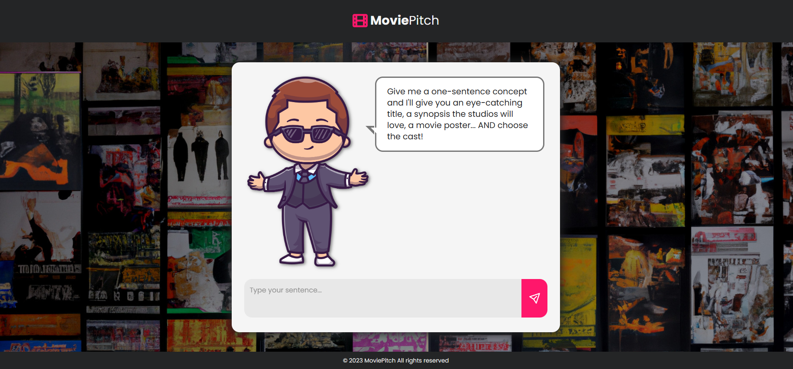
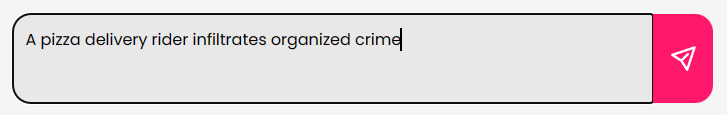
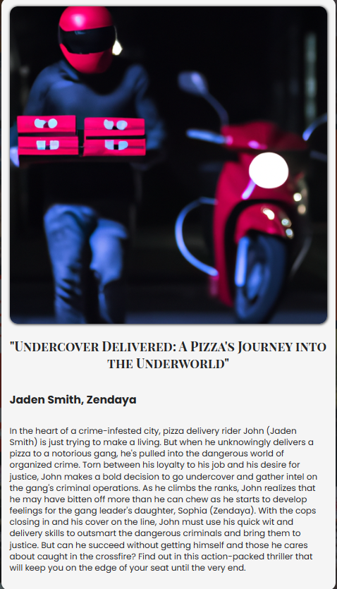

# 🎬 AI powered MoviePitch Web App

This repository contains the source code for a AI powered MoviePitch web application built using chatGPT, Dall-E, GPT-3.5 Turbo & JavaScript. 

MoviePitch is an AI-powered application that transforms a simple one-sentence idea into a full-fledged movie concept complete with a synopsis, title, cast, and cover art. This project leverages the capabilities of the OpenAI API, integrating both ChatGPT for text generation and DALL-E for image creation.

In this project, we explore the capabilities of the OpenAI API, utilizing advanced models such as gpt-3.5-turbo-instruct and DALL-E. The application employs various approaches, including the Zero-Shot and Few-Shot techniques, to enhance the quality and diversity of the generated content.


## 👷 Frameworks, Libraries and TechnologiesTechnologies Used

- OpenAI
- ChatGPT
- GPT-3.5 Turbo
- Dall-E
- JavaScript
- CSS 
- HTML
- Vite

## 🚀 Quick start

### Clone the repository

```
git clone https://github.com/oviran/MoviePitch-AI-powered-.git
```

### Build the project

```
cd MoviePitch
npm install

```

### Run the project

```
npm run dev
````

The project can be reached at https://viran-moviepitch.netlify.app/


## 🔧 Implementation features

### UI of MoviePitch



### Input Box

Type simple one-sentence idea



### Final Output

full-fledged movie concept complete with a synopsis, title, character names, and cover art




## ✍️ Authors

- [OshadhaViran](https://github.com/oviran)

## 📜 License

Distributed under the MIT License. See `LICENSE` for more information.

## 📞 Contact

Oshadha Viran - [@linkedin](https://www.linkedin.com/in/oshadha-viran-847b751a3/) - oviran@gmail.com


